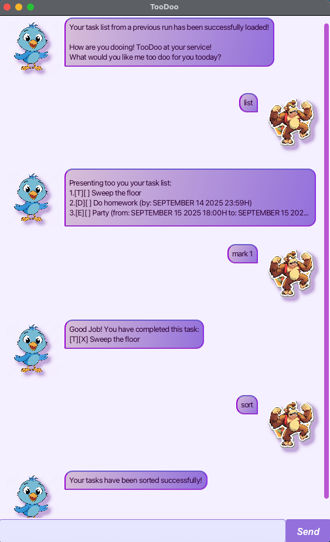

# 🐣 TooDoo User Guide

> **"It's not knowing what to do; it's doing what you know."** – Tony Robbins

Welcome to **TooDoo** - your sassy, charismatic task management sidekick! 🚀 TooDoo is designed to help you stay organized, productive, and maybe even have a little fun while managing your tasks. With its lightning-fast command-line interface and delightful personality, TooDoo makes task management feel less like a chore and more like a conversation with a helpful (if slightly cheeky) friend.



*✨ TooDoo combines the power of a CLI with the charm of a GUI - the best of both worlds!*

## 🚀 Quick Start

Get up and running with TooDoo in just a few minutes! Here's your quick start guide:

1. **📦 Prerequisites** - Ensure you have Java 17 or above installed
   - 💻 Mac users: Get the right JDK version [here](https://docs.oracle.com/en/java/javase/17/install/installation-jdk-macos.html)
   - 🪟 Windows/Linux: Download from [Oracle](https://www.oracle.com/java/technologies/downloads/) or use [OpenJDK](https://openjdk.org/)

2. **⬇️ Download** - Grab the latest `.jar` file from our [releases page](https://github.com/ChekaLowQiJun/ip/releases/tag/A-AiAssisted)

3. **📁 Setup** - Place the jar file in your preferred directory

4. **⚡ Run** - Open terminal and execute:
   ```bash
   cd /path/to/your/directory
   java -jar TooDoo.jar
   ```

5. **🎉 Welcome!** - The TooDoo interface will appear, ready for your commands!

**🎯 Try these commands to get started:**
```bash
list                    # 📋 See all your tasks
todo Read book          # 📝 Add a simple task
deadline Submit assignment /by 2024-10-10 23:59  # ⏰ Add a task with deadline
mark 1                  # ✅ Complete your first task
bye                     # 👋 Exit gracefully
```

## 🎪 Features Galore!

TooDoo comes packed with features to make task management a breeze. Here's everything you can do:

📋 **Command Format Guide:**
- `UPPER_CASE` = Parameters you provide (e.g., `DESCRIPTION` in `todo DESCRIPTION`)
- `[optional]` = Optional components (but some commands require certain parts!)
- Parameters can be in any order for multi-part commands
- Extra stuff gets ignored for simple commands (like `list 123` becomes just `list`)

### 📝 Adding a todo task: `todo`
Adds a simple, no-fuss task to your list.

**Format:** `todo DESCRIPTION`

**Examples:**
- `todo Read book` 📚
- `todo Buy groceries` 🛒
- `todo Call mom` 📞

### ⏰ Adding a deadline task: `deadline`
Perfect for time-sensitive tasks that need to be done by a specific date.

**Format:** `deadline DESCRIPTION /by DATETIME`

- `DATETIME` format: `yyyy-MM-dd HH:mm` (e.g., `2024-10-10 23:59`)

**Examples:**
- `deadline Submit assignment /by 2024-10-10 23:59` 📝
- `deadline Pay bills /by 2024-09-20 17:00` 💸
- `deadline Birthday gift shopping /by 2024-12-24 18:00` 🎁

### 🎉 Adding an event task: `event`
For tasks that span a specific time period - meetings, parties, you name it!

**Format:** `event DESCRIPTION /from START_DATETIME /to END_DATETIME`

- Both times use format: `yyyy-MM-dd HH:mm`
- End time must be after start time (no time travel allowed! 🚫⏰)

**Examples:**
- `event Project meeting /from 2024-09-15 14:00 /to 2024-09-15 15:00` 👥
- `event Birthday party /from 2024-12-25 18:00 /to 2024-12-25 23:00` 🎂
- `event Study session /from 2024-10-05 19:00 /to 2024-10-05 22:00` 📚

### 📋 Listing all tasks : `list`
See everything you've got going on at a glance.

**Format:** `list`

### ✅ Marking a task as done : `mark`
Celebrate those wins! 🎉 Mark tasks as completed.

**Format:** `mark INDEX`

- `INDEX` = The task number from your list (starting from 1)

**Examples:**
- `mark 1` - Complete the first task

### 🔄 Unmarking a task : `unmark`
Changed your mind? No worries! Unmark tasks if needed.

**Format:** `unmark INDEX`

**Examples:**
- `unmark 1` - Oops, not done yet!
- `unmark 3` - Third task needs more work

### 🗑️ Deleting a task : `delete`
Remove tasks you no longer need. Out of sight, out of mind! ✨

**Format:** `delete INDEX`

**Examples:**
- `delete 3` - Remove the third task

### 🔍 Finding tasks by keyword: `find`
Lost in your task list? Find what you need quickly!

**Format:** `find KEYWORD`

- Case-insensitive search
- Searches task descriptions only

**Examples:**
- `find book` - Find all reading tasks 📚
- `find project` - Locate project-related tasks 🎯
- `find 2024` - Find tasks with dates this year 📅

### 🔄 Sorting tasks : `sort`
Organize your tasks neatly. Currently sorts by task type.

**Format:** `sort`

### 👋 Exiting the program : `bye`
Time to say goodbye? TooDoo will miss you! 😢

**Format:** `bye`

## ❓ Frequently Asked Questions
**Q: What date format should I use?** 📅
**A:** Stick to `yyyy-MM-dd HH:mm` (e.g., `2024-12-25 18:00` for Christmas dinner at 6 PM)

**Q: Can I create tasks without specific times?** ⏳
**A:** Absolutely! Use `todo` for tasks without dates - perfect for ongoing or flexible tasks.

**Q: Is TooDoo really free?** 🎁
**A:** 100% FREE! No hidden costs, no subscriptions - just pure task management goodness.

## ⚠️ Known Quirks

1. **Date Format Stickler** 📅 - TooDoo is very particular about date formats. Use `yyyy-MM-dd HH:mm` exactly!
2. **Time Travel Prevention** ⏰ - Events must have end times after start times (TooDoo hasn't mastered time travel yet)
3. **Counting Starts at 1** 🔢 - Task indices begin at 1, not 0 (because we're friendly like that)
4. **Case-Insensitive Searching** 🔍 - `FIND`, `find`, and `Find` all work the same way

## 🎯 Command Cheat Sheet

| Action | Command | Example |
|--------|---------|---------|
| **Add Todo** | `todo DESCRIPTION` | `todo Read book` |
| **Add Deadline** | `deadline DESC /by TIME` | `deadline Submit /by 2024-10-10 23:59` |
| **Add Event** | `event DESC /from START /to END` | `event Party /from 2024-12-25 18:00 /to 23:00` |
| **List Tasks** | `list` | `list` |
| **Mark Done** | `mark INDEX` | `mark 1` |
| **Unmark** | `unmark INDEX` | `unmark 2` |
| **Delete** | `delete INDEX` | `delete 3` |
| **Find** | `find KEYWORD` | `find book` |
| **Sort** | `sort` | `sort` |
| **Exit** | `bye` | `bye` |

---

**Happy task managing!** 🎉 TooDoo is here to make your life easier, one task at a time. Remember: it's not about doing everything perfectly, but about making progress on what matters most. 🚀

*TooDoo: Because getting things done should be delightful!* ✨
